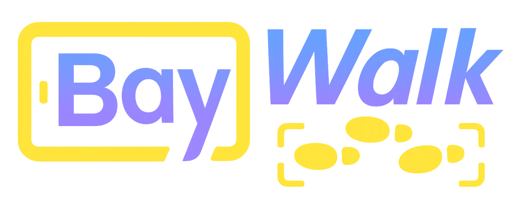

**Walk the bay once. Leave with the BOM, coverage plan, edge sizing, IaC, Jira stories, and a compliance pack.**

BayWalk is a mobile-plus-backend field-architect tool for manufacturing and industrial sites. An on-site “bay walk” becomes deployable artifacts: camera FOV layout with occlusion checks, Jetson vs IPC sizing, PoE and power budgets, hardware BOMs with cost roll-ups, Terraform and Kubernetes manifests, Ignition/OPC-UA tag maps, MQTT topic plans, Jira epics and stories, and a signed compliance bundle. Operates one sprint ahead to unblock delivery teams.

---

## Highlights

- **Scan to Plan:** Capture a quick walkthrough with anchors, export a scene, and generate full planning outputs.
- **Hardware-aware:** Lens selection, mount options, lighting notes, PoE budgets, thermal/power envelopes, and UPS guidance.
- **Edge sizing:** Choose Jetson vs IPC+GPU with throughput math (fps × cams × models), memory and thermal checks.
- **Coverage math:** FOV placement, occlusion detection, and coverage heatmaps with target thresholds.
- **Delivery kit:** Terraform, Helm/K8s, Triton or ONNX Runtime pipeline skeletons, plus MQTT topics and OPC-UA tag CSVs.
- **Agile ready:** Jira epics and stories with DoR/DoD, AC, risks, and spike templates for the next 2–3 sprints.
- **Compliance pack:** Traceability matrix, IQ/OQ/PQ templates, change-control SOP, and signed evidence bundle.

---

## Architecture

```mermaid
flowchart TB
  A[Mobile (React Native/Expo)<br/>Export Scene JSON] --> B[API (FastAPI)<br/>Upload/Plan/Generate]
  B --> C[Planners<br/>Coverage (Open3D/OpenCV)<br/>Edge sizing (OR-Tools)<br/>Power/PoE<br/>Routing]
  C --> D[Generators<br/>IaC (Terraform/Helm)<br/>Integrations (OPC-UA/MQTT)<br/>Jira JSON<br/>Compliance bundle<br/>Runtime (ORT/Triton)]
  B --> E[Policy Gate (OPA)<br/>Evidence Signer (cosign)]
  D --> F[(delivery-kit/<pid>)]
  B --> G[(Postgres)]
  D --> H[(Object Store S3/MinIO)]
  B --> I[Observability<br/>/metrics (Prometheus)<br/>OTEL traces]
```

**Core libs:** FastAPI, OpenCV, Open3D, OR-Tools, Pydantic, OPA (via REST), Triton or ONNX Runtime, cosign, Infracost.  
**Edge profiles:** Jetson Orin NX/Xavier or Industrial PC + compact GPU.  
**Observability:** OpenTelemetry, Prometheus, Grafana.

---

## Repository Layout

```
BayWalk/
app/                     # React Native (Expo) mobile scanner
backend/
  api/                   # FastAPI routers and DTOs
  planners/              # coverage, power/PoE, edge sizing, routing
  generators/            # terraform, k8s, mqtt, opcua, jira, runtime
  policy/                # OPA policies and client
  evidence/              # signer, SBOM, provenance
  db/                    # models, session
  tests/                 # unit/integration tests
delivery-kit/            # emitted IaC and artifacts (per project)
docs/
  bom/                   # reference BOMs (Jetson vs IPC)
runtime/                 # Triton/ORT runtime configs & Dockerfiles
```

---

## Quickstart

### Prerequisites
- Node 18+, PNPM, Xcode/Android Studio (mobile)
- Python 3.11+, uv, Docker, Docker Compose
- cosign, opa, infracost (optional)

### 1) Backend

```bash
# services
make up
# env
cp backend/.env.example backend/.env
# deps
cd backend && ../.venv/Scripts/python -m uv pip install -r requirements.in && cd ..
# start API
.\.venv\Scripts\python -m uvicorn api.main:app --port 8080
```

### 2) Mobile app

```bash
cd app
pnpm install
pnpm expo start
```

### 3) First project

```bash
# seed (optional)
.\.venv\Scripts\python backend/scripts/seed_sample_scene.py
# upload scene
curl -s -X POST http://localhost:8080/projects/upload \
  -H "Content-Type: application/json" \
  -d '{"scene": {"anchors":[{"type":"bay_rect","width_m":20,"height_m":10}],"zones":[{"name":"lane_A"}]},"name":"Bay A","targets":{"num_cameras":8,"target_fps":8}}'
# plan & generate
curl -X POST http://localhost:8080/projects/<pid>/plan
curl -X POST http://localhost:8080/projects/<pid>/generate
```

Artifacts are written to `delivery-kit/<pid>/` and evidence to `backend/evidence/<pid>/`.

---

## Production Run

```bash
# build image
docker build -t baywalk-backend ./backend
# run (ensure backend/.env configured)
docker run --rm -p 8080:8080 --env-file backend/.env baywalk-backend
# health and metrics
curl http://localhost:8080/healthz
curl http://localhost:8080/metrics
```

---

## Reviewer Checklist

- Architecture: Mermaid diagram (vertical), data stores, kit outputs
- Repro: Quickstart works; /healthz and /metrics respond
- Contracts: OpenAPI models in `api/schemas.py`; example curl requests
- Tests: `pytest -q` green; smoke script runs end-to-end
- Lint/Types: `ruff check` and `mypy` clean (CI gates)
- Security: no secrets in repo; SECURITY.md present; SBOM/scan in CI
- Persistence: DB-backed projects; env-configurable `DATABASE_URL`
- Observability: Prometheus metrics; OTEL hooks in agents
- Delivery kit: expected folders and exec OnePager present
- CI: artifacts uploaded (sbom.json, infracost.json)

---

## Field Workflow

1. **Walk Bay** – app exports `Scene JSON` with anchors
2. **Map Coverage** – Open3D/OpenCV coverage and heatmap
3. **Place Cams** – OR-Tools ILP (optional) and wall placement
4. **Size Edge** – throughput → Jetson vs IPC profile
5. **Route Cables** – straight-line heuristic for MVP
6. **Forge BOM** – catalog mapping and totals
7. **Gate Policies** – OPA defaults (MVP allow) + evidence
8. **Spin Stories** – Jira JSON
9. **Print Kits** – IaC, integrations, runtime configs, OnePager

---

## Policy, Security, and Costs
- Policy: OPA Rego under `backend/policy/rego`; MVP endpoint returns allow=true with inputs captured
- Security: cosign evidence stub; secrets via env; see SECURITY.md
- Costs: BOM roll-up + Infracost (optional)

---

## Contributing
See `CONTRIBUTING.md`. PRs must pass tests, ruff, mypy, and security scan.
